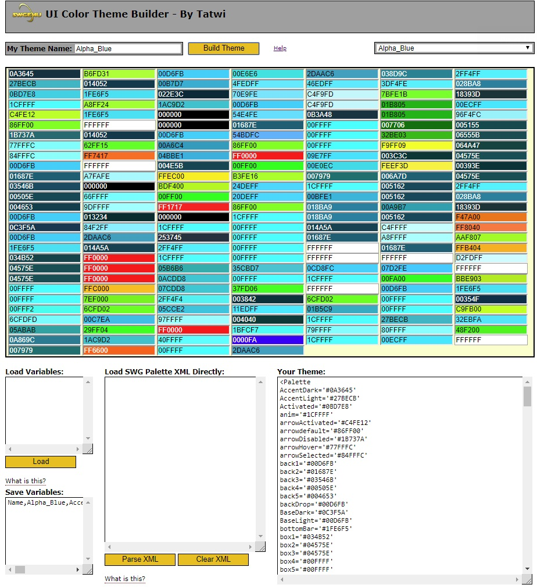

# UI Color Theme Builder for SWGEmu

## About
This is a browser based javascript tool designed to help people create ui color themes more easily (than manually changing the values). It also gives the user the ability to save their variables (to a text file on their computer and load them in again another day). The tool generates theme code that can be pasted into one's ui_styles.inc or ui_palette_ground.inc file. Does not effect the space UI theme.

## Status 
As of version 19.0, the tool is now feature complete!  

- Accepts input of the standard SWG XML palettes (from ui_styles.inc / ui_palette_ground.inc), one at a time.
- Preloaded with all the default SWG palettes, plus 4 of mine, and one all grey one for testing.
- Uses a simple table to store/load preloaded palettes (in themes.js).

## Requires
I can verify that it works in Google Chrome 72! Simply download or clone the repo and double click on theme_builder_dev.html to run it.

## Help
Customizing your UI color scheme in SWGEmu is very easy, thanks to the hard work of the modders of yore. All you need to do is download two files (ui_palette_ground.inc and ui_styles.inc), put them in a folder called "ui" inside folder where you installed SWGEmu (For example C:\Program Files\SWGEmu\ui\), and then paste any new themes you make at the bottom of the ui_palette_ground.inc file.

I have included the two files in the ui folder of this repository for your convenience.

## Creating a Theme
I made this tool because I wanted to make my own ui color themes, but it was such a pain in the rear to manually edit the template file, look up colors, figure out what values do what to the game's ui and then try to remember all that another day. This tool removes much of that frustration and time sinking, by providing you with two things:

- An array of all the colors used in the theme, which makes it easy to evaluate how they work together.
- Tool tips with verbose descriptions of what the colors do in the ui.

To create your own theme, all you need to do is the following,  

- Choose a pre-loaded theme as a starting point. There is an all grey one if you'd like a clean slate.
- Personally I would suggest starting from the left and working your way down each column, as that is how the entries flow alphabeticaly. Read the tool tips for help and remember that <b>back1</b> is the one color that sets the tone for your whole theme.
- Pick the colors you would like to use simply by clicking on a color block and using the <a href="http://jscolor.com/">JSColor</a> selector to highlight your desired color.
- Once you have the color you'd like for a slot, close that JSColor box and move on to the next one.
- When you have all your colors setup how you'd like them, go ahead and give your theme a name and press the build button.
- Back Up You Hard Work! Copy your variables, from the "Save Variables" box, to a plain textfile on your computer by clicking in the box, doing a "control A" to select all the text, and a "control C" to copy the text to the clipboard. Paste it into the text file and save it. Personally, I name my variables text files "Name of the Theme VARS" to help me remember what they are. :)	If you want to modify your theme again another day it's as simple as coming back to this site, pasting your variables into the "Load Variables" box, and pressing the Load button.			
- Ya did it! You now have a new ui color theme to use in SWGEmu!

To use your theme in the game,  

- Close Star Wars Galaxies
- Select all the text in the "Your Theme:" window and copy it to the clipboard.
- Open ui_palette_ground.inc file, scroll to the bottom, and paste your theme onto a new line.
- Save the file and start Star Wars Galaxies.
- Your new theme will now be in the list of available themes in the game!

## Notes and Tips
- The default theme that game uses for the character selection screen is "Alpha_Blue". If you would like to change it, all you need to do is rename the default name="Alpha_Blue" entry in ui_palette_ground.inc to something else (say "Original Alpha Blue") and then rename the name="" entry for your desired theme to "Alpha_Blue".
- I had to manually fix some errors in the XML for default Imperial theme when I converted it variables for use with this tool. arrrowHover was duplicated, contrast3h was missing.

## Additional Themes
I have included some additional color themes inside the [community_palettes](community_palettes) directory. These themes were created by members of the SWG community over the years. The themes are stored in their original XML format and are compatible with this tool.  

There are many other community created color themes that can be found on the SWGEmu forums, at Mod The Galaxy, and included in with custom modded SWGEmu servers. You can use [TREExplorer](https://modthegalaxy.com/index.php?threads/tre-explorer-small-update.70/) or [Sytner's IFF Editor](https://modthegalaxy.com/index.php?threads/about-sie.370/) to poke around inside the TRE files of custom server installations.
